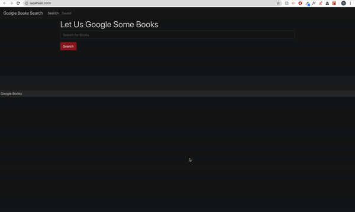

# Google-Books

<!-- ## Deployed Repo

- HTML
https://ohhhhhwhen.github.io/React-Portfolio/ -->

## Assignment info

Making a Google Books Search app, while using a public
google API. A react app that takes in the search query 
and displays a list of books related to the search criteria.
Also, users are able to view the books on google and save their
searched books to a saved list. All books are saved to a Mongo 
Database. Using Mlab addon from heroku.

## Technologies

Project is created with:

- Bootstrap v4.4
- Visual Studios Code (HTML/CSS/JS/JQ)
- Google/W3
- Node.js
- Express
- NPM
- Mongoose
- React


## Running Pages

- Here's gif of the running page from an images folder:




## Key Notes

- Links and Scripts added

```
    <script
      src="https://kit.fontawesome.com/ce46380fe9.js"
      crossorigin="anonymous"
    ></script>
    <link
      rel="stylesheet"
      href="https://maxcdn.bootstrapcdn.com/font-awesome/4.6.3/css/font-awesome.min.css"
    />
    <link
      href="https://fonts.googleapis.com/css2?family=Anton&family=Oxygen:wght@700&display=swap"
      rel="stylesheet"
    />
```

- NPM

* install
* run
* deploy
* start
